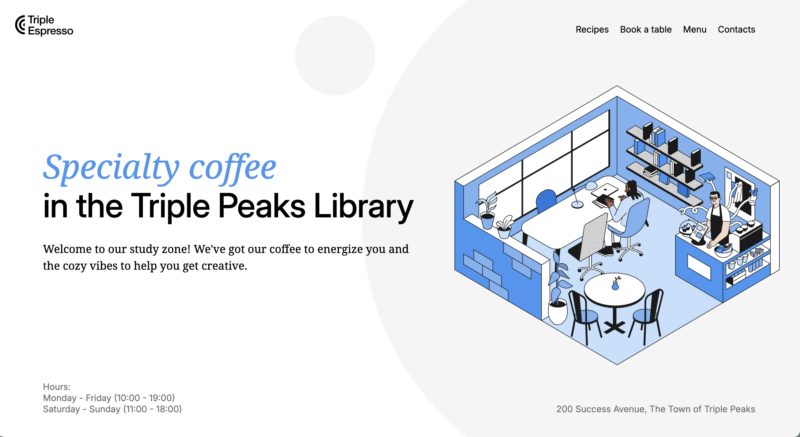
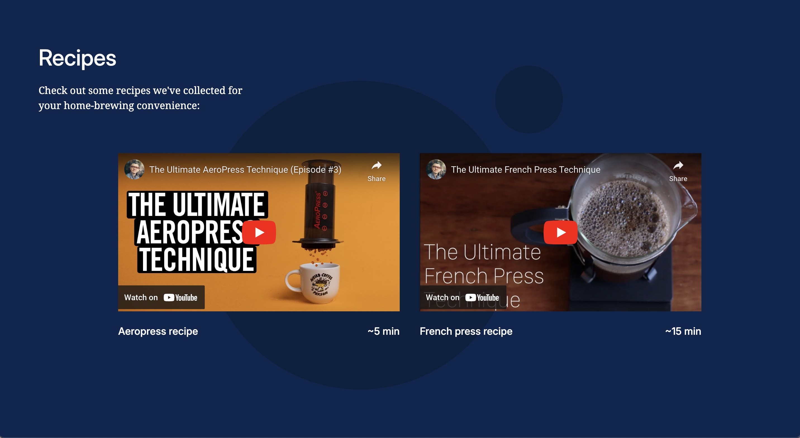
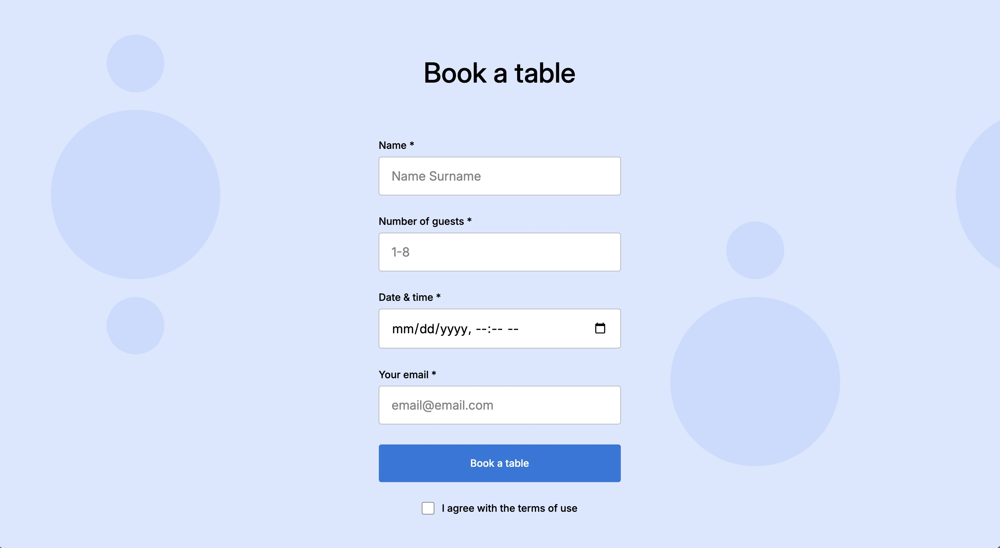

# Triple Peaks Coffee Shop

This is the second project of the Software Engineering program at TripleTen. It was created using HTML and CSS, based on the design brief.

## Project features

- Semantic HTML5
- Flexbox
- Positioning
- Flat BEM file structure
- A custom form
- CSS animation and transform

## Plan on improving the project

Creating a layout and implenting the different concepts learned throughout the course.

## Deployment

When you run the program, you will be able to reach a web page where you will be able navigate through pages and set a reservation for a coffeeshop.

No requirements needed!
